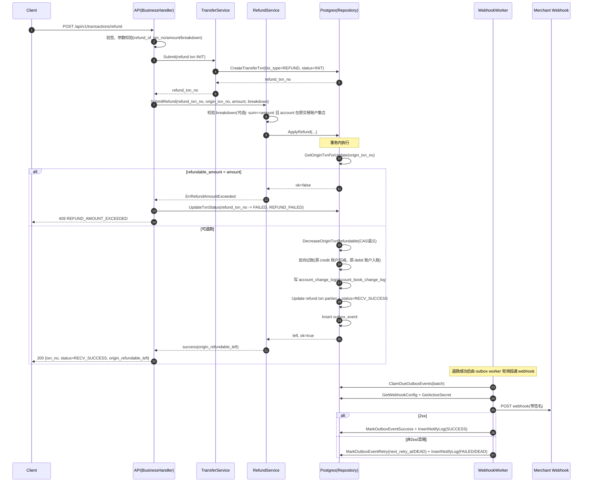

# 退款时序图

```mermaid
sequenceDiagram
    autonumber
    participant C as Client
    participant API as API(BusinessHandler)
    participant TS as TransferService
    participant RS as RefundService
    participant DB as Postgres(Repository)
    participant WW as WebhookWorker
    participant WH as Merchant Webhook

    C->>API: POST /api/v1/transactions/refund
    API->>API: 验签、参数校验(refund_of_txn_no/amount/breakdown)
    API->>TS: Submit(refund txn INIT)
    TS->>DB: CreateTransferTxn(biz_type=REFUND, status=INIT)
    DB-->>TS: refund_txn_no
    TS-->>API: refund_txn_no

    API->>RS: SubmitRefund(refund_txn_no, origin_txn_no, amount, breakdown)
    RS->>RS: 校验 breakdown(可选): sum==amount 且 account 在原交易账户集合
    RS->>DB: ApplyRefund(...)

    Note over DB: 事务内执行
    DB->>DB: GetOriginTxnForUpdate(origin_txn_no)
    alt refundable_amount < amount
        DB-->>RS: ok=false
        RS-->>API: ErrRefundAmountExceeded
        API->>DB: UpdateTxnStatus(refund_txn_no -> FAILED, REFUND_FAILED)
        API-->>C: 409 REFUND_AMOUNT_EXCEEDED
    else 可退款
        DB->>DB: DecreaseOriginTxnRefundable(CAS语义)
        DB->>DB: 反向记账(原 credit 账户扣减，原 debit 账户入账)
        DB->>DB: 写 account_change_log/account_book_change_log
        DB->>DB: Update refund txn parties + status=RECV_SUCCESS
        DB->>DB: Insert outbox_event
        DB-->>RS: left, ok=true
        RS-->>API: success(origin_refundable_left)
        API-->>C: 200 {txn_no, status=RECV_SUCCESS, origin_refundable_left}
    end

    Note over WW: 退款成功后由 outbox worker 轮询投递 webhook
    WW->>DB: ClaimDueOutboxEvents(batch)
    WW->>DB: GetWebhookConfig + GetActiveSecret
    WW->>WH: POST webhook(带签名)
    alt 2xx
        WW->>DB: MarkOutboxEventSuccess + InsertNotifyLog(SUCCESS)
    else 非2xx/异常
        WW->>DB: MarkOutboxEventRetry(next_retry_at/DEAD) + InsertNotifyLog(FAILED/DEAD)
    end
```
