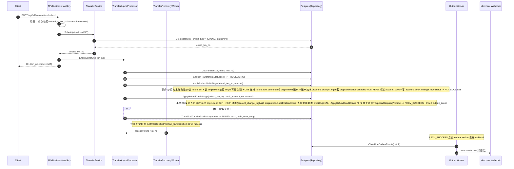

# 核心交易反向时序图（Refund）

```mermaid
sequenceDiagram
    autonumber
    participant C as Client
    participant API as API(BusinessHandler)
    participant TS as TransferService
    participant AP as TransferAsyncProcessor
    participant RW as TransferRecoveryWorker
    participant DB as Postgres(Repository)
    participant OW as OutboxWorker
    participant WH as Merchant Webhook

    C->>API: POST /api/v1/transactions/refund
    API->>API: 验签、参数校验(refund_of_txn_no/amount/breakdown)
    API->>TS: Submit(refund txn INIT)
    TS->>DB: CreateTransferTxn(biz_type=REFUND, status=INIT)
    DB-->>TS: refund_txn_no
    TS-->>API: refund_txn_no
    API->>AP: Enqueue(refund_txn_no)
    API-->>C: 201 {txn_no, status=INIT}

    AP->>DB: GetTransferTxn(refund_txn_no)
    AP->>DB: TransitionTransferTxnStatus(INIT -> PROCESSING)

    AP->>DB: ApplyRefundDebitStage(refund_txn_no, amount)
    Note over DB: 事务内(反向出账阶段)\n锁 refund txn + 锁 origin txn\n校验 origin 可退余额 + CAS 递减 refundable_amount\n扣 origin.credit 账户 + 账户流水(account_change_log)\n若 origin.credit.BookEnabled=true: FEFO 扣减 account_book + 写 account_book_change_log\nstatus -> PAY_SUCCESS

    AP->>DB: ApplyRefundCreditStage(refund_txn_no, credit_account_no, amount)
    Note over DB: 事务内(反向入账阶段)\n加 origin.debit 账户 + 账户流水(account_change_log)\n若 origin.debit.BookEnabled=true: 当前实现要求 creditExpireAt，ApplyRefundCreditStage 传 nil 会失败(ErrExpireAtRequired)\nstatus -> RECV_SUCCESS + Insert outbox_event

    alt 任一阶段失败
        AP->>DB: TransitionTransferTxnStatus(current -> FAILED, error_code, error_msg)
    end

    Note over RW: 兜底补偿轮询 INIT/PROCESSING/PAY_SUCCESS 并重试 Process
    RW->>AP: Process(refund_txn_no)

    Note over OW: RECV_SUCCESS 后由 outbox worker 投递 webhook
    OW->>DB: ClaimDueOutboxEvents(batch)
    OW->>WH: POST webhook(带签名)
```
