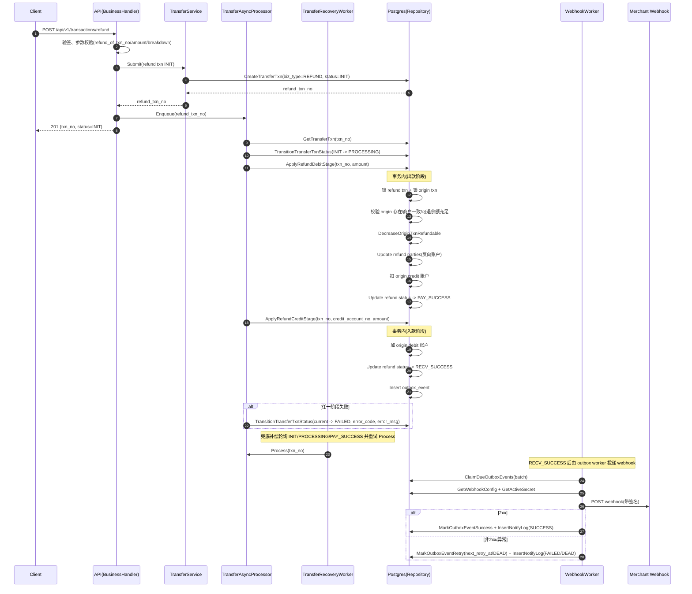

# 退款时序图

```mermaid
sequenceDiagram
    autonumber
    participant C as Client
    participant API as API(BusinessHandler)
    participant TS as TransferService
    participant AP as TransferAsyncProcessor
    participant RW as TransferRecoveryWorker
    participant DB as Postgres(Repository)
    participant WW as WebhookWorker
    participant WH as Merchant Webhook

    C->>API: POST /api/v1/transactions/refund
    API->>API: 验签、参数校验(refund_of_txn_no/amount/breakdown)
    API->>TS: Submit(refund txn INIT)
    TS->>DB: CreateTransferTxn(biz_type=REFUND, status=INIT)
    DB-->>TS: refund_txn_no
    TS-->>API: refund_txn_no
    API->>AP: Enqueue(refund_txn_no)
    API-->>C: 201 {txn_no, status=INIT}

    AP->>DB: GetTransferTxn(txn_no)
    AP->>DB: TransitionTransferTxnStatus(INIT -> PROCESSING)

    AP->>DB: ApplyRefundDebitStage(txn_no, amount)
    Note over DB: 事务内(出款阶段)
    DB->>DB: 锁 refund txn + 锁 origin txn
    DB->>DB: 校验 origin 存在/商户一致/可退余额充足
    DB->>DB: DecreaseOriginTxnRefundable
    DB->>DB: Update refund parties(反向账户)
    DB->>DB: 扣 origin.credit 账户
    DB->>DB: Update refund status -> PAY_SUCCESS

    AP->>DB: ApplyRefundCreditStage(txn_no, credit_account_no, amount)
    Note over DB: 事务内(入款阶段)
    DB->>DB: 加 origin.debit 账户
    DB->>DB: Update refund status -> RECV_SUCCESS
    DB->>DB: Insert outbox_event

    alt 任一阶段失败
        AP->>DB: TransitionTransferTxnStatus(current -> FAILED, error_code, error_msg)
    end

    Note over RW: 兜底补偿轮询 INIT/PROCESSING/PAY_SUCCESS 并重试 Process
    RW->>AP: Process(txn_no)

    Note over WW: RECV_SUCCESS 后由 outbox worker 投递 webhook
    WW->>DB: ClaimDueOutboxEvents(batch)
    WW->>DB: GetWebhookConfig + GetActiveSecret
    WW->>WH: POST webhook(带签名)
    alt 2xx
        WW->>DB: MarkOutboxEventSuccess + InsertNotifyLog(SUCCESS)
    else 非2xx/异常
        WW->>DB: MarkOutboxEventRetry(next_retry_at/DEAD) + InsertNotifyLog(FAILED/DEAD)
    end
```
