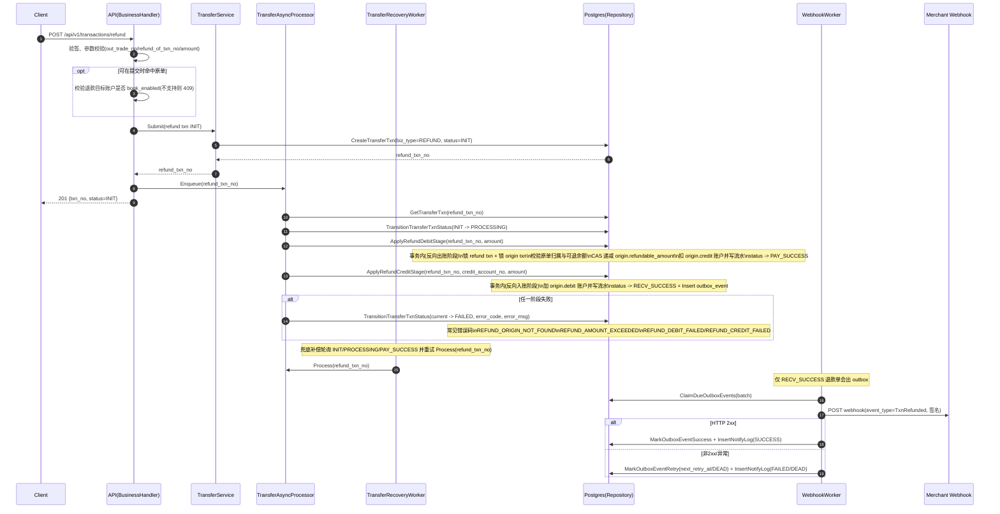

# 核心交易反向时序图（Refund）

```mermaid
sequenceDiagram
    autonumber
    participant C as Client
    participant API as API(BusinessHandler)
    participant TS as TransferService
    participant AP as TransferAsyncProcessor
    participant RW as TransferRecoveryWorker
    participant DB as Postgres(Repository)
    participant OW as WebhookWorker
    participant WH as Merchant Webhook

    C->>API: POST /api/v1/transactions/refund
    API->>API: 验签、参数校验(out_trade_no/refund_of_txn_no/amount)
    opt 可在提交时命中原单
        API->>API: 校验退款目标账户是否 book_enabled(不支持则 409)
    end
    API->>TS: Submit(refund txn INIT)
    TS->>DB: CreateTransferTxn(biz_type=REFUND, status=INIT)
    DB-->>TS: refund_txn_no
    TS-->>API: refund_txn_no
    API->>AP: Enqueue(refund_txn_no)
    API-->>C: 201 {txn_no, status=INIT}

    AP->>DB: GetTransferTxn(refund_txn_no)
    AP->>DB: TransitionTransferTxnStatus(INIT -> PROCESSING)

    AP->>DB: ApplyRefundDebitStage(refund_txn_no, amount)
    Note over DB: 事务内(反向出账阶段)\n锁 refund txn + 锁 origin txn\n校验原单归属与可退余额\nCAS 递减 origin.refundable_amount\n扣 origin.credit 账户并写流水\nstatus -> PAY_SUCCESS

    AP->>DB: ApplyRefundCreditStage(refund_txn_no, credit_account_no, amount)
    Note over DB: 事务内(反向入账阶段)\n加 origin.debit 账户并写流水\nstatus -> RECV_SUCCESS + Insert outbox_event

    alt 任一阶段失败
        AP->>DB: TransitionTransferTxnStatus(current -> FAILED, error_code, error_msg)
        Note over DB: 常见错误码\nREFUND_ORIGIN_NOT_FOUND\nREFUND_AMOUNT_EXCEEDED\nREFUND_DEBIT_FAILED/REFUND_CREDIT_FAILED
    end

    Note over RW: 兜底补偿轮询 INIT/PROCESSING/PAY_SUCCESS 并重试 Process(refund_txn_no)
    RW->>AP: Process(refund_txn_no)

    Note over OW: 仅 RECV_SUCCESS 退款单会出 outbox
    OW->>DB: ClaimDueOutboxEvents(batch)
    OW->>WH: POST webhook(event_type=TxnRefunded, 签名)
    alt HTTP 2xx
        OW->>DB: MarkOutboxEventSuccess + InsertNotifyLog(SUCCESS)
    else 非2xx/异常
        OW->>DB: MarkOutboxEventRetry(next_retry_at/DEAD) + InsertNotifyLog(FAILED/DEAD)
    end
```
