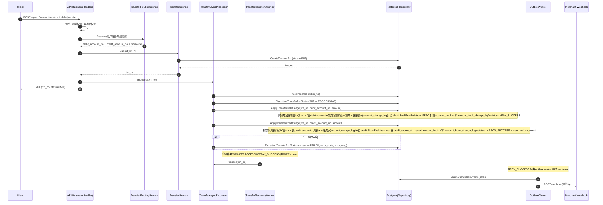

# 核心交易正向时序图

```mermaid
sequenceDiagram
    autonumber
    participant C as Client
    participant API as API(BusinessHandler)
    participant RT as TransferRoutingService
    participant TS as TransferService
    participant AP as TransferAsyncProcessor
    participant RW as TransferRecoveryWorker
    participant DB as Postgres(Repository)
    participant OW as OutboxWorker
    participant WH as Merchant Webhook

    C->>API: POST /api/v1/transactions/credit|debit|transfer
    API->>API: 验签、参数校验、幂等键校验
    API->>RT: Resolve(账户路由/场景规则)
    RT-->>API: debit_account_no + credit_account_no + biz/scene
    API->>TS: Submit(txn INIT)
    TS->>DB: CreateTransferTxn(status=INIT)
    DB-->>TS: txn_no
    TS-->>API: txn_no
    API->>AP: Enqueue(txn_no)
    API-->>C: 201 {txn_no, status=INIT}

    AP->>DB: GetTransferTxn(txn_no)
    AP->>DB: TransitionTransferTxnStatus(INIT -> PROCESSING)

    AP->>DB: ApplyTransferDebitStage(txn_no, debit_account_no, amount)
    Note over DB: 事务内(出账阶段)\n锁 txn + 锁 debit account\n能力/余额校验 + 扣减 + 出账流水(account_change_log)\n若 debit.BookEnabled=true: FEFO 扣减 account_book + 写 account_book_change_log\nstatus -> PAY_SUCCESS

    AP->>DB: ApplyTransferCreditStage(txn_no, credit_account_no, amount)
    Note over DB: 事务内(入账阶段)\n锁 txn + 锁 credit account\n入账 + 入账流水(account_change_log)\n若 credit.BookEnabled=true: 需 credit_expire_at，upsert account_book + 写 account_book_change_log\nstatus -> RECV_SUCCESS + Insert outbox_event

    alt 任一阶段失败
        AP->>DB: TransitionTransferTxnStatus(current -> FAILED, error_code, error_msg)
    end

    Note over RW: 兜底补偿轮询 INIT/PROCESSING/PAY_SUCCESS 并重试 Process
    RW->>AP: Process(txn_no)

    Note over OW: RECV_SUCCESS 后由 outbox worker 投递 webhook
    OW->>DB: ClaimDueOutboxEvents(batch)
    OW->>WH: POST webhook(带签名)
```
